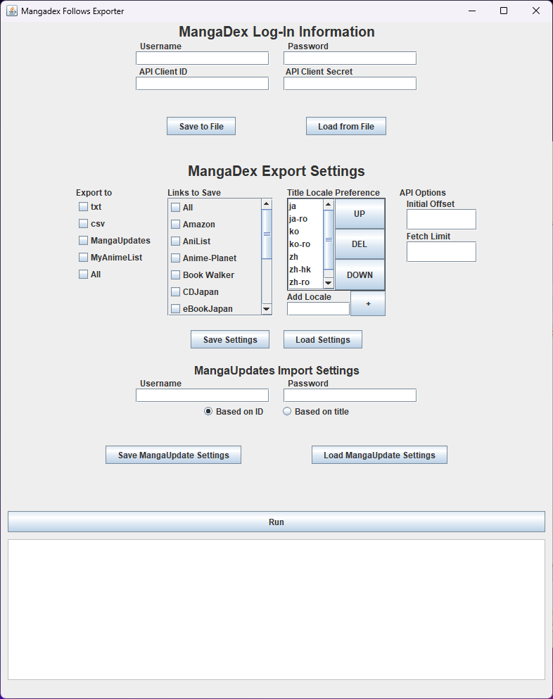

# About
This application exports a user's list of followed manga on MangaDex. Currently, you can export to
* Text files
* A CSV
* MangaUpdates (requires a MangaUpdates account)
* MyAnimeList



# Requirements
* An internet connection
* A MangaDex account and [API Client credentials](https://api.mangadex.org/docs/02-authentication/personal-clients/)
* A MangaUpdates account (optional if not exporting to MangaUpdates)

# Installation
* Download one of the files from the [latest release](https://github.com/Kenneth-W-Chen/mangadex-follows-exporter/releases/latest).
  * Download the JAR if you have Java 21 installed and know how to run a JAR.
  * Download the installer if you don't have Java 21 and follow the installation process provided in it.

# Usage
* Fill out your MangaDex API client information in the top 4 input boxes under the `MangaDex Log-In Information` section.
  * You can save/load this and other settings by pressing the corresponding buttons.
* Select your export settings in the `MangaDex Export Settings` section.
  * `Export to` subsection - lets you select where to export series info to.
    * `txt`
      * The titles and saved links are in separate files.
      * Each title/link is separated by a newline.
      * If a title doesn't have a corresponding link (e.g., no Amazon link) then the line will be "null".
    * `csv`
      * The titles and saved links are in a single file in a comma-separated format.
      * The first row will be a header.
      * Each row corresponds to a single series.
      * If a title doesn't have a corresponding link, the link will be labeled as "null".
    * `MangaUpdates`
      * Uses the MangaUpdates API to add titles to a custom reading list, "My MangaDex Follows".
      * Requires a MangaUpdates account. 
      * Does not require saving the MangaUpdates link in the `Links to save` subsection.
    * `MyAnimeList`
      * Creates a XML file that can be used [here](https://myanimelist.net/import.php) to import titles to MyAnimeList.
      * If MangaDex doesn't provide a MyAnimeList ID/link with the series, the series won't be exported.
      * Does not require a MyAnimeList account to create. (Importing does.) 
  * `Links to Save` subsection - lets you select which links to save in the `txt` and `csv` export formats.
    * Most names are the name of the website.
    * `Official English` will be a link to wherever the official English translation of the series is sold or published (e.g., a MANGA Plus link).
    * `Raws` will be a link to wherever the series is sold/published at in its original language (e.g., a ComicWalker link).
  * `Title Locale Preference` subsection - Sets the preference for which title translation to save in the `txt` and `csv` formats.
    * Locales follow a modified ISO 639-1 standard. See [MangaDex's API documentation](https://api.mangadex.org/docs/3-enumerations/#language-codes--localization) for more details.
    * If "original" is provided, the application will try to use one of the series' titles in its original language. Some series have multiple titles in the same language, so it may not pick the one you want. E.g., "Kumo Desu ga, Nani ka?" also has "kumoko" as one of its ja-ro titles.
    * Select a locale in the list and use the `UP` or `DOWN` buttons to change its priority. The locales at the top will be prioritized over the ones below.
    * Add a locale by entering the locale in the `Add Locale` input box and pressing the `+` button or enter.
      * Locales are inserted above the currently selected locale or at the top of the list if a locale isn't selected.
  * `API Options` subsection - sets settings for MangaDex API calls.
    * `Initial Offset` sets the initial index to start fetching from. Indices do not correspond to what's shown in your library.
    * `Fetch Limit` sets the max number of titles to fetch per API call. MangaDex will return no more than this number. 100 is the max, set by MangaDex.
* `MangaUpdates Import Settings` section - enter your MangaUpdates username and password if you're exporting series to MangaUpdates.
  * `Based on ID` - adds series based on their ID. This option takes a while to run because it has to fetch an actual ID via a webpage, since MangaDex saves the page ID instead. This will have fewer errors than adding by title because it will only add titles that MangaDex says has a MangaUpdates page.
  * `Based on title` - adds series based on the title saved. This may add more titles than using IDs if MangaDex doesn't have the MangaUpdates link. This may also fail more if the title saved isn't one MangaUpdates has as one of the series' titles.
* Press the run button to run the program with the displayed settings.
* The area below the run button provides information while the program runs.
* Information related to MangaUpdates and MyAnimeList exports will be output to a file, `MD_Exporter_Stats_{now}.txt` where "{now}" is the date and time of when the program finished fetching series from MangaDex. Has the following info:
  * Series that couldn't be exported.
    * For MangaUpdates, a reason is provided (e.g., series was already on another list).
  * The number of series, the number of series that were exported, and the number of series that weren't exported.
  * For MangaUpdates, how the series were imported to MangaUpdates (i.e., by ID or title).
 
# Building
* Download the git repository and unzip it if necessary.
* In a terminal, navigate to the repository directory and run
```bash
./gradlew build
 ```
* If you want to make an installer, run
```bash
./gradlew createExe
```